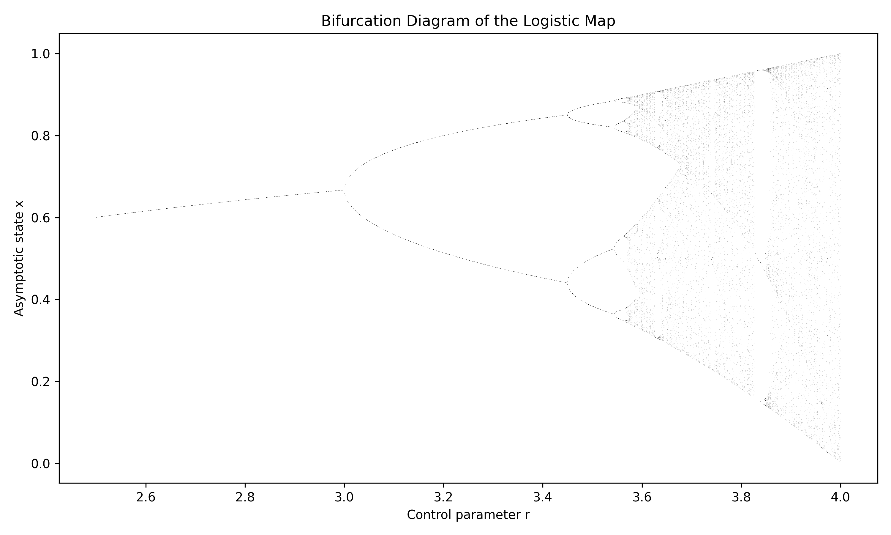

# Chaos in the Logistic Map: Bifurcation, Sensitivity to Initial Conditions, and the Onset of Deterministic Chaos

This project is part of a broader portfolio on complex systems focused on nonlinear dynamics, network structure, and data-driven analysis.

---

## Overview

This project investigates the logistic map as a minimal nonlinear dynamical system capable of generating qualitatively different long-term behaviors from a simple deterministic rule.

---

## Key Scientific Takeaway
> The logistic map demonstrates that complexity does not require complicated rules: a simple deterministic update can generate bifurcations, chaotic regimes, and severe predictability limits. The Lyapunov exponent strengthens this interpretation by quantitatively distinguishing stable behavior from chaos.

---

## Scientific Motivation

A central question in complex systems is how simple deterministic rules can generate complex and unpredictable behavior. The logistic map provides a minimal framework to study the transition from order to chaos.

---

## Research Question

How does the behavior of the logistic map change as the control parameter increases, and how can chaotic regimes be identified through bifurcation, sensitivity to initial conditions, and Lyapunov exponent analysis?

---

## Model

xₙ₊₁ = r xₙ (1 − xₙ)

---

## Methods

- Time-series simulation  
- Bifurcation diagram  
- Sensitivity to initial conditions  
- Lyapunov exponent estimation  

---

## Results

- Transition from fixed points to periodic and chaotic regimes  
- Period-doubling bifurcations  
- Strong divergence of nearby trajectories  
- Positive Lyapunov exponents in chaotic regions  

---

## Interpretation

Deterministic nonlinear systems can become effectively unpredictable due to exponential divergence of trajectories. Chaos emerges from structure, not randomness.

---

## Relevance to Complex Systems

Illustrates fundamental mechanisms of emergence, instability, and predictability limits in nonlinear systems.

---

## Limitations and Future Work

- Lyapunov estimation can be refined  
- Study of periodic windows  
- Extension to other nonlinear systems  
