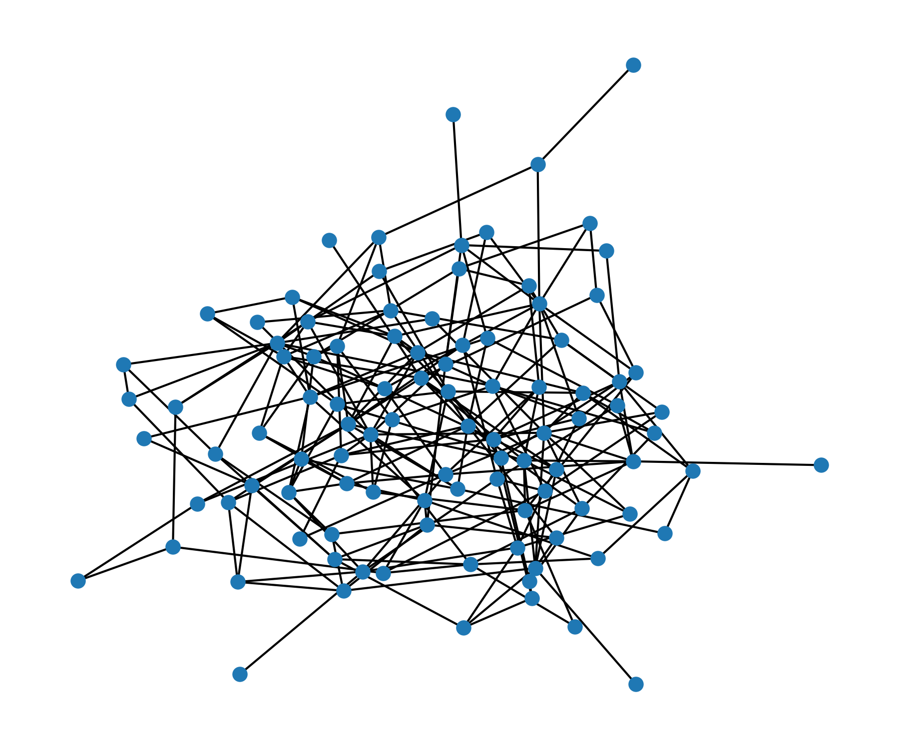
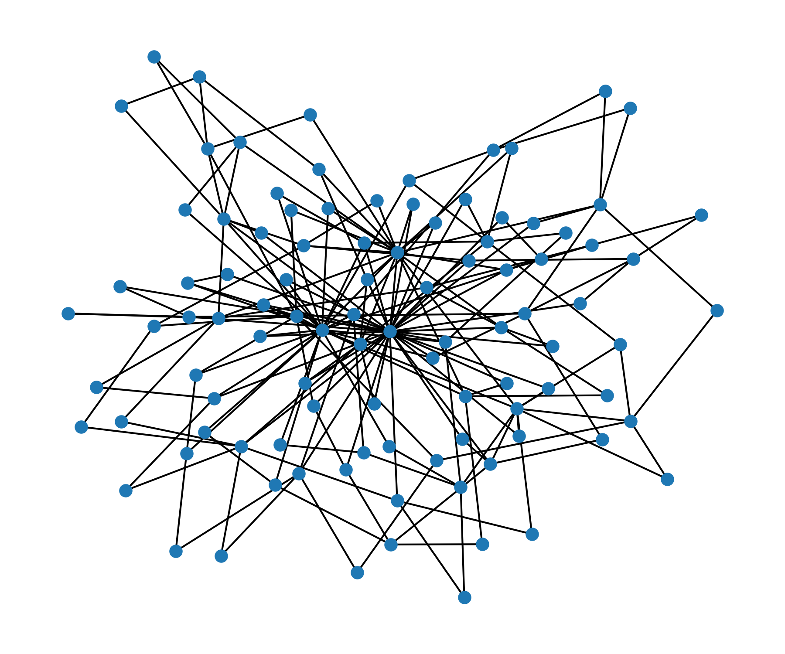
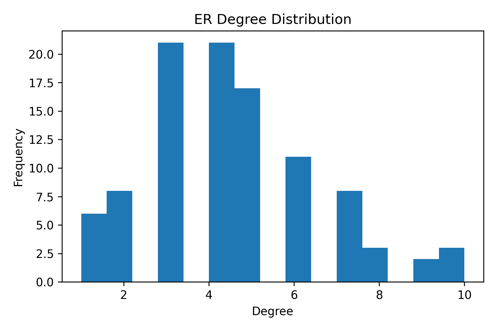
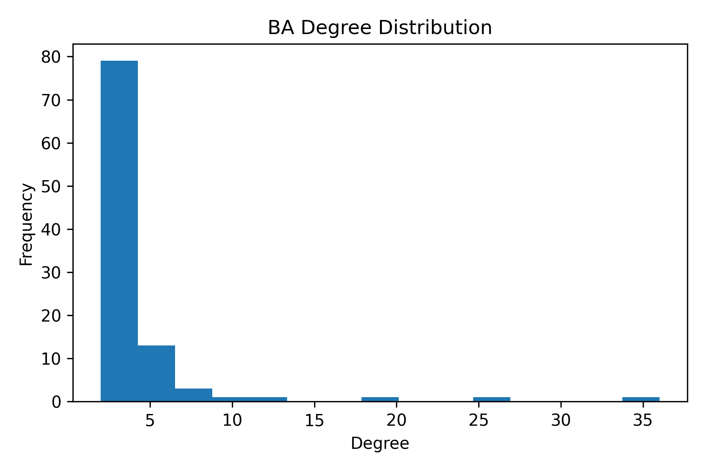

# Network Structure and Emergence: A Comparative Analysis of Random and Scale-Free Networks

This project is part of a broader computational portfolio exploring complex systems, with a focus on network structure, emergent behavior, and data-driven analysis.

---

## Overview

This project investigates how different network generation mechanisms give rise to distinct global structures. By comparing Erdős–Rényi random graphs and Barabási–Albert scale-free networks, we analyze how simple local connection rules influence macroscopic organization.

---

## Key Scientific Takeaway

> Global network structure is not imposed but emerges from simple local rules. Preferential attachment generates heterogeneous, hub-dominated topologies, whereas random linking produces homogeneous connectivity patterns.

---

## Scientific Motivation

In complex systems, the structure of interactions plays a central role in determining system behavior. Many real-world systems — including social, technological, and biological networks — exhibit non-random connectivity patterns. Understanding how these structures arise is fundamental to studying robustness, diffusion processes, and systemic risk.

---

## Research Question

How do different network formation mechanisms influence:

* degree distribution
* connectivity patterns
* emergence of structural heterogeneity

---

## Models

### Erdős–Rényi (Random Graph)

* Uniform probability of connection between nodes
* Produces homogeneous degree distribution

### Barabási–Albert (Scale-Free Network)

* Growth with preferential attachment ("rich-get-richer")
* Produces hubs and heavy-tailed distributions

---

## Methods

* Generation of networks with equal size (n = 100)
* Computation of structural metrics:

  * Average degree
  * Clustering coefficient
  * Largest connected component
* Visualization of network topology
* Degree distribution analysis

---

## Results

* Random networks exhibit narrow, approximately Poisson-like degree distributions
* Scale-free networks display heavy-tailed distributions
* Hub formation emerges naturally under preferential attachment
* Structural heterogeneity is significantly higher in scale-free networks

---

## Visual Results

### Network Structures

**Erdős–Rényi Network**


**Barabási–Albert Network**


---

### Degree Distributions

**Erdős–Rényi Degree Distribution**


**Barabási–Albert Degree Distribution**


---

## Interpretation

The results demonstrate that network topology is highly sensitive to generative mechanisms. While random networks produce uniform connectivity, preferential attachment leads to the emergence of hubs, fundamentally altering network behavior.

This has important implications for:

* robustness (scale-free networks are resilient to random failures)
* vulnerability (but fragile to targeted attacks)
* information and signal propagation

---

## Relevance to Complex Systems

This project highlights a core principle of complex systems:

> **Structure emerges from local interaction rules.**

It complements the dynamical perspective explored in Project 1 (logistic map and chaos), extending the analysis from temporal dynamics to structural organization.

---

## Code

The implementation is available in:

```
network_analysis.py
```

Main features:

* Network generation (Erdős–Rényi and Barabási–Albert models)
* Structural metric computation
* Network visualization
* Degree distribution analysis

---

## How to Run

Install dependencies:

```bash
pip install networkx matplotlib numpy
```

Run the script:

```bash
python network_analysis.py
```
