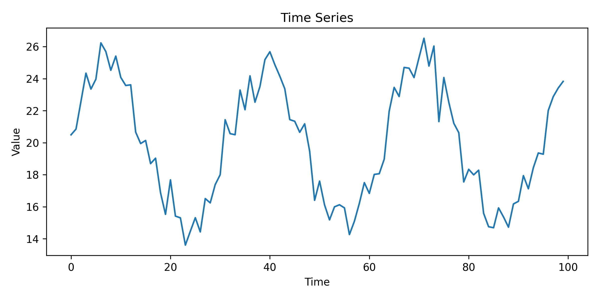
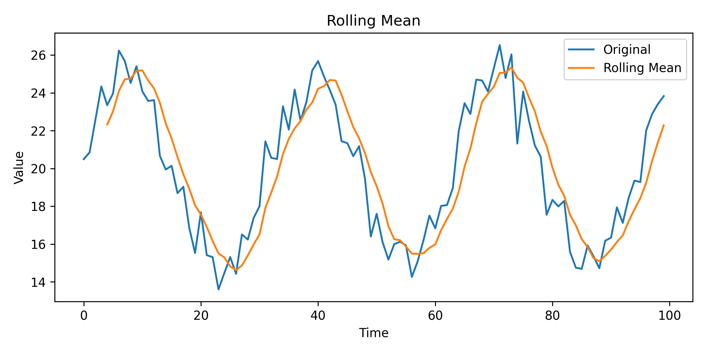
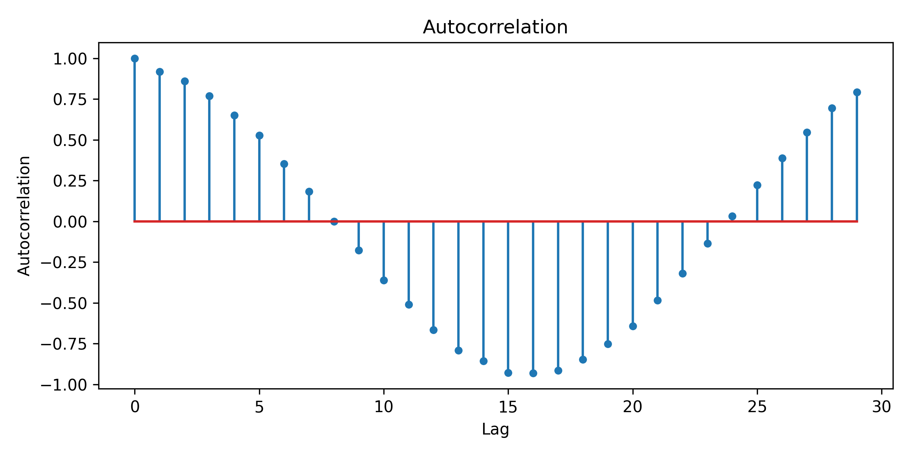
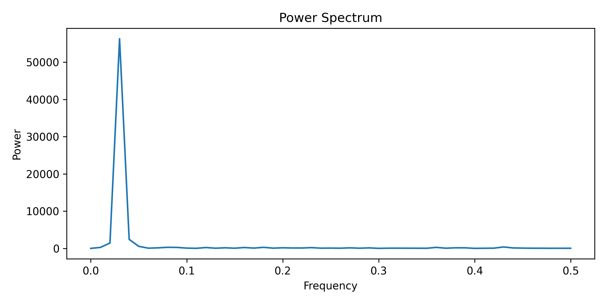

# Structure and Randomness in Time-Series Data: Statistical and Spectral Analysis of Noisy Signals

This project is part of a broader computational portfolio exploring complex systems, with a focus on nonlinear dynamics, emergent behavior, and data-driven analysis.

---

## Overview

This project investigates how structured temporal patterns can be identified in the presence of noise. Using synthetic time-series data composed of a deterministic signal with stochastic perturbations, we apply statistical and spectral tools to extract hidden structure.

---

## Key Scientific Takeaway

> Variability in observed data does not imply the absence of structure. Even in noisy signals, temporal organization remains detectable through appropriate analytical tools such as autocorrelation and spectral analysis.

---

## Scientific Motivation

Many real-world complex systems generate noisy observations, where underlying dynamics are not directly observable. Examples include climate systems, financial markets, biological signals, and engineering processes.

Understanding how to distinguish signal from noise is fundamental for:

* identifying hidden periodicities
* characterizing system behavior
* extracting meaningful information from data

---

## Research Question

How can structured temporal patterns be identified and characterized in noisy time-series data?

---

## Data

The dataset consists of a synthetic time series combining:

* a deterministic periodic component
* additive random noise

This controlled setup allows clear evaluation of how analytical methods recover underlying structure.

---

## Methods

The following techniques were applied:

* Time-series visualization
* Rolling mean (trend smoothing)
* Autocorrelation function (temporal dependency analysis)
* Fourier Transform (frequency domain analysis)

---

## Results

* The rolling mean reveals the underlying trend despite noise
* Autocorrelation identifies periodic structure across time lags
* Spectral analysis highlights dominant frequencies in the signal
* Noise introduces variability but does not eliminate detectable structure

---

## Visual Results

### Time Series



---

### Rolling Mean



---

### Autocorrelation



---

### Power Spectrum



---

## Interpretation

The analysis demonstrates that even when signals appear irregular, underlying structure can be recovered through appropriate methods.

* Autocorrelation reveals temporal dependencies and periodicity
* Fourier analysis identifies dominant frequencies in the data
* Rolling statistics help separate signal from noise

These results illustrate a fundamental principle:

> **Noise masks structure, but does not destroy it.**

---

## Relevance to Complex Systems

This project highlights a key aspect of complex systems:

> **Observed randomness often coexists with hidden order.**

It complements:

* Project 1 → nonlinear dynamics (chaos and sensitivity)
* Project 2 → structural emergence in networks

Here, the focus shifts to **temporal structure and signal analysis**.

---

## Code

The implementation is available in:

```
timeseries_analysis.py
```

Main features:

* Synthetic signal generation (signal + noise)
* Rolling mean computation
* Autocorrelation analysis
* Fourier transform (power spectrum)
* Data visualization

---

## How to Run

Install dependencies:

```bash
pip install numpy matplotlib pandas
```

Run the script:

```bash
python timeseries_analysis.py
```

---

## Limitations and Future Work

* Synthetic dataset (controlled conditions)
* No predictive modeling applied
* Limited exploration of non-stationary signals

Future improvements:

* Apply to real-world datasets
* Introduce filtering techniques (e.g., wavelets)
* Extend to nonlinear time-series analysis

---

## Final Remark

> Apparent randomness often conceals underlying structure that can be revealed through proper analysis.
